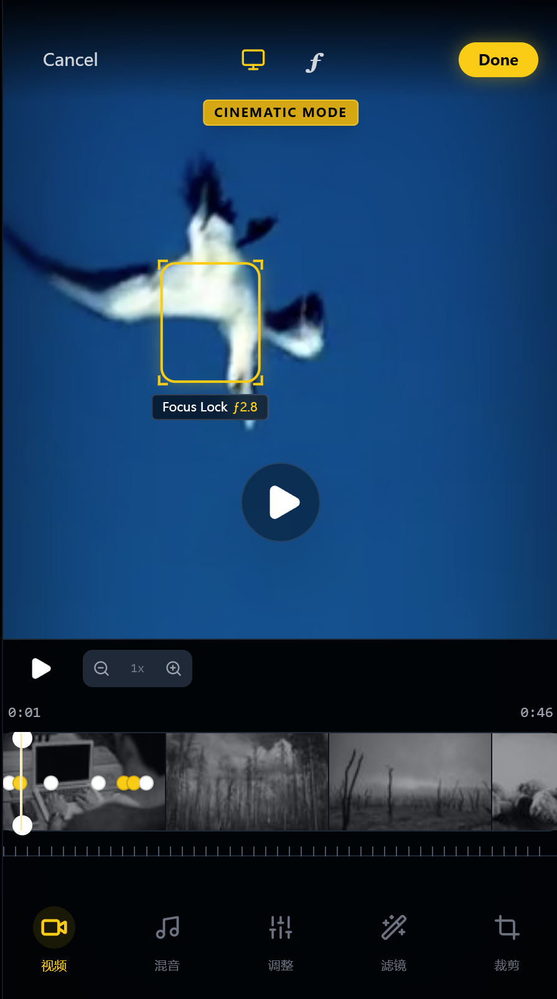

<div align="center">
  
</div>

# CineFocus Editor

一个面向“电影模式后期重调”场景的视频编辑原型。它把景深模拟、焦点关键帧、时间线定位和参数化编辑组合成一套可交互工作流，让用户可以在视频拍摄之后重新指定焦点主体、调整虚化强度，并在移动端和桌面 NLE 两种界面模式下完成同一套编辑任务。

## 产品定位

这个项目解决的不是“普通视频剪辑”，而是“拍完以后还能重新决定观众看哪里”。

它关注的是一种更偏影像语言的编辑体验：

- 在时间线上按镜头节奏切换焦点主体
- 用类似电影模式的方式模拟景深变化
- 用关键帧记录焦点位置和光圈变化
- 在消费级交互和专业型 NLE 界面之间建立统一操作逻辑

从产品视角看，它更像一个“Cinematic Focus”编辑模块原型，而不是完整的视频剪辑系统。

## 面向的用户

- 移动影像产品团队：探索电影模式 / 景深重调的交互方案
- 视频编辑器产品经理与设计师：验证移动端和桌面端的编辑模型
- 计算摄影与视频算法团队：演示焦点重定向和景深控制的产品形态
- 创作者工具团队：评估“焦点编辑”是否值得作为独立功能模块接入

## 核心使用流程

1. 打开一段示例视频
2. 在播放或拖拽时间线过程中定位需要调整的时刻
3. 点击画面设置新的焦点位置
4. 为当前时刻创建或更新焦点关键帧
5. 调整光圈值，改变景深虚化强度
6. 在时间线上查看多个焦点切换点
7. 在移动端界面和桌面 NLE 界面之间切换观察编辑方式
8. 导出结果视频

## 当前版本能力

### 1. 焦点重定向

- 支持在视频画面上直接点击设置新的焦点位置
- 支持按时间点创建手动焦点关键帧
- 支持系统焦点点位与手动焦点点位共存
- 当前播放位置会自动选取有效焦点并驱动画面展示

### 2. 景深与光圈控制

- 支持基于 `f-stop` 调整虚化强度
- 用遮罩和模糊层模拟景深效果
- 支持在不同时间点为不同焦点设置不同光圈值
- 适合演示“拉焦”“焦点转移”“主体重定向”等电影化效果

### 3. 时间线编辑

- 支持视频时间线拖拽和播放定位
- 支持焦点关键帧在时间线上的可视化展示
- 支持时间线缩放
- 支持在回放过程中跟随当前播放头自动更新焦点状态

### 4. 双界面模式

- 移动端模式：更接近消费级视频编辑器和手机电影模式体验
- NLE 模式：更接近专业桌面编辑器的轨道、检查器和关键帧编辑逻辑
- 两种模式共享同一套焦点数据和参数状态
- 适合团队在“轻交互”和“专业交互”之间快速比较方案

### 5. NLE 风格参数编辑

- 支持在检查器中直接修改 `focus_x`
- 支持在检查器中直接修改 `focus_y`
- 支持在检查器中直接修改光圈参数
- 支持一键添加关键帧

### 6. 导出与演示能力

- 内置视频加载与回放
- 支持多视频源 fallback
- 提供导出按钮和导出流程占位
- 适合作为产品 demo、交互验证和概念演示

## 产品价值

这个项目的产品价值主要体现在三个方向：

- 把“电影模式拍摄能力”从拍摄时扩展到后期编辑阶段
- 把抽象的景深 / 焦点算法效果转化为用户可理解、可操控的交互系统
- 为移动端与桌面端统一焦点编辑模型提供验证样板

相比传统剪辑工具，它增加的是“注意力控制”；相比纯算法演示，它强调的是“用户怎样真正编辑焦点”。

## 适用场景

- 手机电影模式视频的后期重调焦
- 计算摄影效果的产品化验证
- 视频编辑器中的“主体焦点跟随”功能原型
- 创作者工具中的电影感增强模块
- 团队内部评审时演示交互方向和参数设计

## 当前技术实现

这是一个前端交互原型，核心实现包括：

- React 19 + TypeScript
- Vite 构建
- 基于视频层与覆盖层的景深模拟
- 基于关键帧的数据结构管理焦点状态
- 两套 UI 模式切换：移动端编辑模式与桌面 NLE 模式
- 时间线、参数检查器和焦点标记的联动展示

当前景深效果属于前端视觉模拟，更侧重产品交互验证，而不是高精度真实光学渲染。

## 当前边界与限制

这个版本适合作为概念验证和交互原型，但还不是生产级视频编辑器：

- 当前景深效果是 UI 级模拟，不是真实的深度估计与重渲染
- 焦点切换逻辑目前偏演示型，插值和跟踪策略还可以继续增强
- 导出流程目前主要是交互占位，不对应真实的视频渲染管线
- 视频素材依赖外部示例源，未接入本地媒体管理系统
- 尚未支持多片段项目、真实音视频同步编辑、协作与工程保存

## 后续演进方向

- 接入真实深度图或分割结果，提升景深重建质量
- 增加焦点关键帧插值、平滑拉焦和主体跟踪
- 支持多片段项目、轨道级编辑和镜头级管理
- 接入真实导出渲染流程
- 增加自动主体识别与推荐焦点
- 与移动端电影模式素材采集链路打通

## 本地运行

### 环境要求

- Node.js

### 启动方式

```bash
npm install
npm run dev
```

### 构建生产包

```bash
npm run build
```

## 仓库结构

```text
CineFocus-Editor/
├── App.tsx                    # 主工作台与双模式切换
├── components/
│   ├── VideoOverlay.tsx       # 视频层、焦点框与景深模拟
│   ├── Timeline.tsx           # 移动端时间线
│   ├── NLEInspector.tsx       # NLE 参数检查器
│   ├── NLETimeline.tsx        # NLE 风格轨道时间线
│   └── FStopSlider.tsx        # 光圈控制滑杆
├── constants.ts               # 初始焦点点位与工具定义
├── types.ts                   # 焦点、工具和 UI 模式类型
├── vercel.json                # 部署配置
└── assets/
    └── readme-banner.png      # README 展示图
```

## 一句话总结

CineFocus Editor 是一个围绕“后期重调焦”设计的视频编辑原型：用关键帧管理焦点，用光圈参数控制景深，用双界面模式验证电影化编辑体验。
